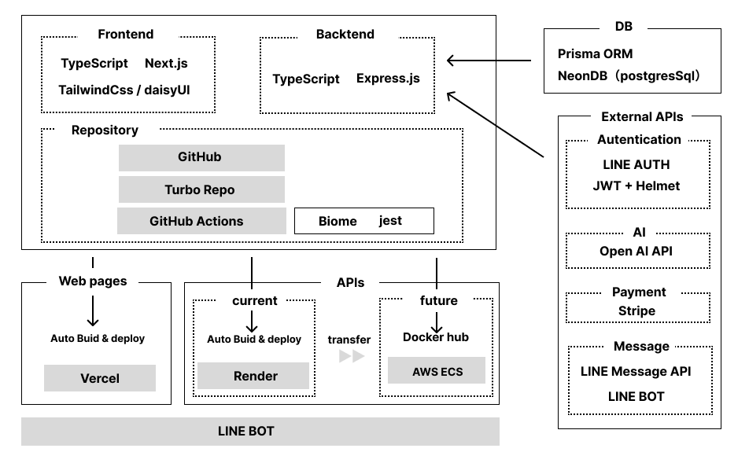

# 🚀 SHIFTRY （※開発段階）
📝[Notionで詳しく見る](https://tinted-arthropod-2d9.notion.site/LINE-AI-SHIFTRY-1f0acff094ee8033a682f4884837d208)      📁[リポジトリへ移動](https://github.com/mkw-tom/SHIFTRY)
- SHIFTRY（シフトリー）**は、LINEとAIを活用した小規模店舗向けのシフト自動化SaaSです。
希望提出から調整・作成・通知まで、すべてLINE上で完結。
専用のLINE botをグループに招待するだけで、スタッフとのやり取りをスムーズにします。

「シフト管理はスマホで。」そんな新しい当たり前をつくるべく、日々開発を進めています。

---

## 🧑🏻‍💻 開発状況
- 開発期間：二ヶ月半経過（5/12日時点）
- 人数：1人
- 完成予定：5月下旬に完成予定（MVP完成）

## ✨ 導入までのステップ

1.  **オーナーがLINE BOT「SHIFTRY」を追加**
2.  **line認証＆オーナー・店舗登録**
3.  **Botを店舗のlineグループに招待**
4.  **連携ボタンをポチ → プラン購入**
5.  **完了**

- スタッフは、lineグループ内に「シフト提出依頼通知」の際に送信されたリンクから登録・ログインして、利用します。
  

## 🧩 使用技術
| フロント | バックエンド | DB | 認証 |
| --- | --- | --- | --- |
| TypeScript | TypeScript | neonDB | LINE Auth |
| Next.js | express | prisma | JWT |
| Redux |  |  | Bearer認証 |
| TailwindCSS |  |  | Helmet |
| daisyUI |  |  |  |

| インフラ | 外部API | テスト・フォーマット | その他 |
| --- | --- | --- | --- |
| Vercel (フロント) | LINE BOT | githubActions | turbo |
| Render（バックエンド） | LINE message API | jest | postman |
| AWS ECS（移行予定） | Stripe | biome |  |
|  | openAI api |  |  |

## 🗺️ 技術構成図

